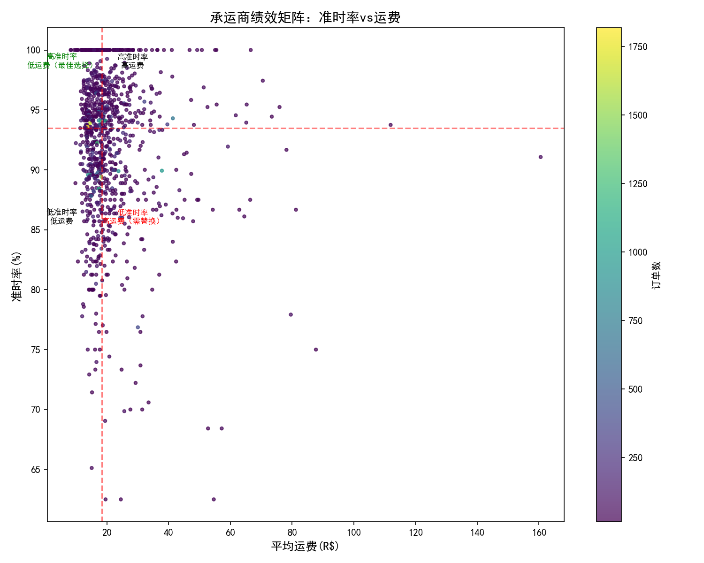
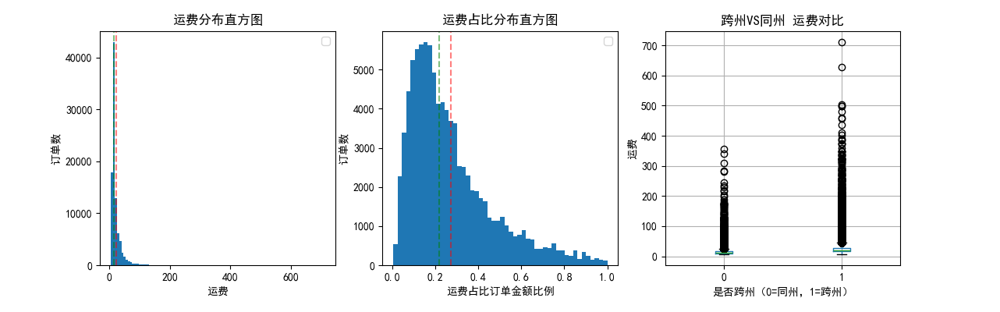
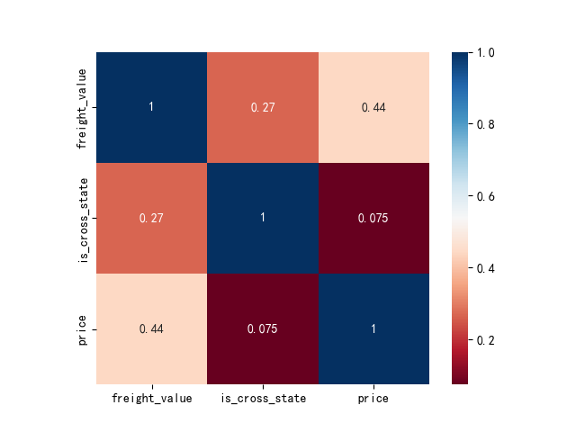

# 巴西电商物流分析：承运商绩效与运费成本预测

> 这是一个针对跨境物流场景的数据分析项目，基于Olist巴西电商数据集，聚焦承运商绩效评估、运费成本分析和运费成本预测。

## 📊 项目概述

### 业务背景
跨境物流公司面临的核心挑战是：**如何在控制成本的同时，提升准时交付率**。本项目模拟物流数据分析师角色，通过分析巴西电商的物流数据，为跨境运输场景提供数据驱动的优化建议。

### 分析目标
1. **承运商绩效评估**：识别不同发货州的物流效率差异
2. **运费成本分析**：找出运费异常订单，分析成本驱动因素
3. **运费成本预测**：构建预测模型，识别高运费的订单

### 核心结论
- **承运商配置失衡**：MA州仅1家承运商，准时率垫底；CE州承运商充足但准时率低且运费高。建议基于绩效矩阵优化承运商选择
- **跨州运费高出73.7%**：异常订单基本来自跨州，运费长尾效应显著
- **重点州设仓可降本14.7%**: 高运费集中于SP、MG、PR等州，将20%跨州转同州预计降本14.7%
- **近1/3订单运费占比超30%**：多为低价商品+跨州组合，建议满减凑单或合并发货
- **预测模型缺失关键变量**：随机森林模型预测运费R²仅0.3119，需引入运输距离重构模型

---

## 🛠 技术栈

| 工具                     | 用途                         |
| ------------------------ | ---------------------------- |
| **SQL (MySQL)**          | 数据提取、承运商绩效指标计算 |
| **Python**               | 数据清洗、统计分析、可视化   |
| **Pandas / NumPy**       | 数据处理                     |
| **Matplotlib / Seaborn** | 可视化图表                   |
| **Scikit-learn**         | 运费成本预测模型             |
| **GitHub**               | 项目版本管理                 |

---

## 📁 项目结构
### 数据准备

数据来源：Olist Brazilian E-Commerce Dataset

下载后将以下文件放入 data/ 文件夹：
olist_orders_dataset.csv
olist_order_items_dataset.csv
olist_sellers_dataset.csv
olist_customers_dataset.csv

### 数据分析

#### 承运商绩效评估

##### 承运商现状

按发运州统计每个州的承运商数量，订单量，平均运输天数，准时运输单数，准时率，及平均运费
```sql
在datagrip中编写运行MYSQL代码：
SELECT s.seller_state,COUNT(distinct oi.seller_id) AS total_sellers,
    COUNT(DISTINCT o.order_id) AS total_orders,
    AVG(DATEDIFF(o.order_delivered_customer_date, o.order_delivered_carrier_date)) AS avg_transit_days,
    COUNT(DISTINCT CASE
        WHEN o.order_delivered_customer_date <= o.order_estimated_delivery_date THEN o.order_id else null END) AS on_time_deliveries,
    ROUND(COUNT(DISTINCT CASE
        WHEN o.order_delivered_customer_date <= o.order_estimated_delivery_date THEN o.order_id else null END)*100/ COUNT(DISTINCT o.order_id), 2) AS on_time_rate,
    AVG(oi.freight_value) AS avg_freight_cost
FROM olist_orders_dataset as o
 JOIN olist_order_items_dataset as oi ON o.order_id= oi.order_id
 JOIN olist_sellers_dataset as s ON oi.seller_id = s.seller_id
WHERE o.order_status='delivered'
    AND o.order_delivered_carrier_date IS NOT NULL
    AND o.order_delivered_customer_date IS NOT NULL
    AND o.order_estimated_delivery_date is not null
GROUP BY s.seller_state
HAVING COUNT(DISTINCT o.order_id)>=5
ORDER BY on_time_rate DESC;
```
| seller\_state 发运州 | total\_sellers 承运商数 | total\_orders 订单数 | avg\_transit\_days 平均运输天数 | on\_time\_deliveries 准时订单数 | on\_time\_rate 准时率 | avg\_freight\_cost 平均运费 |
| :------------------- | :---------------------- | :------------------- | :------------------------------ | :------------------------------ | :-------------------- | :-------------------------- |
| PI                   | 1                       | 11                   | 12.0909                         | 11                              | 100.00                | 37.1409090909091            |
| RO                   | 2                       | 14                   | 14.8571                         | 14                              | 100.00                | 50.91285714285714           |
| SE                   | 2                       | 9                    | 10.4000                         | 9                               | 100.00                | 31.848999999999997          |
| GO                   | 39                      | 451                  | 10.1063                         | 433                             | 96.01                 | 24.17891732283462           |
| RS                   | 125                     | 1962                 | 8.0115                          | 1878                            | 95.72                 | 25.973725218994925          |
| MT                   | 4                       | 136                  | 11.5000                         | 130                             | 95.59                 | 32.05451388888891           |
| PE                   | 9                       | 403                  | 10.5303                         | 385                             | 95.53                 | 27.689775280898942          |
| MG                   | 236                     | 7733                 | 9.5066                          | 7301                            | 94.41                 | 24.011520753400983          |
| PB                   | 6                       | 35                   | 9.1622                          | 33                              | 94.29                 | 39.160270270270274          |
| BA                   | 18                      | 550                  | 10.4471                         | 518                             | 94.18                 | 30.80355769230766           |
| SC                   | 184                     | 3603                 | 10.3723                         | 3388                            | 94.03                 | 26.03692999999995           |
| DF                   | 30                      | 808                  | 9.4247                          | 759                             | 93.94                 | 20.444473386183507          |
| PR                   | 335                     | 7511                 | 9.8449                          | 7027                            | 93.56                 | 22.631308036766704          |
| ES                   | 22                      | 310                  | 10.3297                         | 288                             | 92.90                 | 32.72486263736264           |
| MS                   | 5                       | 49                   | 8.2000                          | 45                              | 91.84                 | 23.979200000000006          |
| RJ                   | 163                     | 4227                 | 9.0517                          | 3872                            | 91.60                 | 19.489237993596642          |
| SP                   | 1769                    | 68635                | 8.9354                          | 62633                           | 91.26                 | 18.415911982494             |
| CE                   | 12                      | 87                   | 14.4222                         | 79                              | 90.80                 | 46.73566666666667           |
| RN                   | 5                       | 51                   | 8.5000                          | 46                              | 90.20                 | 23.287678571428568          |
| PA                   | 1                       | 8                    | 10.0000                         | 7                               | 87.50                 | 19.388749999999998          |
| MA                   | 1                       | 389                  | 12.6368                         | 299                             | 76.86                 | 30.028656716417874          |

洞察发现：

（1）准时率高的发运州运费不一定低，如RO，订单量大的州准时率较差，如SP、RJ；

（2）MA州的发货准时率最低，然而订单数量位于各州中位，与订单数量相当的PE州、ES州相比，发货准时率低许多，原因有可能是MA州的承运商数量最少，只有一家，建议增加该区域的承运商数量；

（3）CE州发货准时率较差，是末位里面运费最高的州，承运商数量并不少，建议优化承运商选择

##### 承运商选择优化

目标：为准时率低的州，从现有承运商中选择最优的替代方案，平衡准时率和运费成本

分析框架：
| 步骤       | 分析内容                         |
| ---------- | -------------------------------- |
| 承运商评估 | 计算每个承运商的准时率和平均运费 |
| 匹配推荐   | 为问题州推荐可替换的承运商       |

SQL实现：

#评估每个承运商（seller_id）的绩效
```sql
SELECT
oi.seller_id,s.seller_state,
    COUNT(DISTINCT o.order_id) AS total_orders,
    COUNT(DISTINCT CASE
        WHEN o.order_delivered_customer_date <= o.order_estimated_delivery_date THEN o.order_id else null END) AS on_time_deliveries,
    ROUND(COUNT(DISTINCT CASE
        WHEN o.order_delivered_customer_date <= o.order_estimated_delivery_date THEN o.order_id else null END)*100/ COUNT(DISTINCT o.order_id), 2) AS on_time_rate,
    AVG(oi.freight_value) AS avg_freight_cost
FROM olist_orders_dataset as o
JOIN olist_order_items_dataset as oi ON o.order_id= oi.order_id
JOIN olist_sellers_dataset as s ON oi.seller_id = s.seller_id
WHERE o.order_status='delivered'
    AND o.order_delivered_customer_date IS NOT NULL
    AND o.order_estimated_delivery_date is not null
GROUP BY oi.seller_id,s.seller_state
HAVING COUNT(DISTINCT o.order_id)>=15
ORDER BY on_time_rate DESC;
```
转Python可视化：供应商选择矩阵
```python
import pandas as pd 
import numpy as np
import matplotlib.pyplot as plt
data=pd.read_csv(r"D:\论文\秒可课程\各承运商绩效评估.csv")
plt.rcParams["font.sans-serif"]=["SimHei"]
#创作四象限图
plt.figure(figsize=(10,8))
#计算中位数作为分界线
x_median=data['avg_freight_cost'].median()
y_median=data["on_time_rate"].median()
#绘制散点图
colors=data["total_orders"]
scatter=plt.scatter(data['avg_freight_cost'],data["on_time_rate"],c=colors,s=10,cmap="viridis",alpha=0.7)
#添加象限分割线
plt.axhline(y=y_median,color="red",linestyle="--",alpha=0.5)
plt.axvline(x=x_median,color="red",linestyle="--",alpha=0.5)
#添加标签
plt.xlabel("平均运费(R$)",fontsize=12)
plt.ylabel("准时率(%)",fontsize=12)
plt.title("承运商绩效矩阵：准时率vs运费",fontsize=14)
plt.colorbar(scatter,label="订单数")
#添加象限说明
plt.text(x_median+10,y_median+5,"高准时率\n高运费",ha="center",fontsize=8)
plt.text(x_median-13,y_median+5,"高准时率\n低运费（最佳选择）",ha="center",fontsize=8,color="green")
plt.text(x_median+10,y_median-8,"低准时率\n高运费（需替换）",ha="center",fontsize=8,color="red")
plt.text(x_median-13,y_median-8,"低准时率\n低运费",ha="center",fontsize=8)
plt.tight_layout()
plt.show()
#输出推荐结果
print("\n=== 承运商推荐排名 ===")
data['score'] = data['on_time_rate'] * 0.6-data['avg_freight_cost'] * 0.4
recommended=data[data['on_time_rate']>90].sort_values(by='score', ascending=False)
print(recommended[['seller_id','seller_state', 'on_time_rate', 'avg_freight_cost', 'total_orders']].head(5))
```


=== 承运商推荐排名 ===

| seller_id 承运商| seller_state 承运商所在州| on_time_rate 准时率（%） | avg_freight_cost 平均运费成本 | total_orders 订单数 |
|-----------|--------------|-------------|------------------|--------------|
| 41c2bad7229b0c25e6becf179ebf63ff | RN | 100.0 | 8.257391 | 20 |
| 30a81d8cf85fb2ada1b1b094c9583a95 | SP | 100.0 | 8.405000 | 17 |
| 48efc9d94a9834137efd9ea76b065a38 | PR | 100.0 | 9.423529 | 33 |
| 325f3178fb58e2a9778334621eecdbf9 | SP | 100.0 | 9.818913 | 36 |
| ba5daa4041e1f15cdf34b76e3e18a450 | SP | 100.0 | 10.170000 | 15 |

业务建议：针对MA州，建议引入2-3家新承运商形成竞争；针对CE州，可基于“承运商推荐排名”中的高绩效承运商（如来自RN、SP、PR州的），尝试小范围订单尝试。

#### 运费成本分析

数据准备与清洗
```python
import pandas as pd
import matplotlib.pyplot as plt
#读取数据
orders=pd.read_csv(r"D:\论文\秒可课程\olist_orders_dataset.csv")
sellers=pd.read_csv(r"D:\论文\秒可课程\olist_sellers_dataset.csv")
customers=pd.read_csv(r"D:\论文\秒可课程\olist_customers_dataset.csv")
items=pd.read_csv(r"D:\论文\秒可课程\olist_order_items_dataset.csv",usecols=['order_id','seller_id','price','freight_value'])
#筛选已交付订单
orders_delivered=orders[(orders['order_status']=="delivered")&(~orders['order_delivered_carrier_date'].isnull())&(~orders['order_delivered_customer_date'].isnull())].copy()
#由于订单产品明细表仅按同一订单号下的产品数量进行分行拆分，其他相同（如产品ID,价格，运费等），无很大细化分析的意义，为方便后续订单级别的分析，按订单号进行合并
items_new=items.groupby("order_id").agg({'seller_id':'first','price':'sum','freight_value':'sum'}).reset_index()
#合并数据表
df=pd.merge(orders_delivered,items_new,how="inner") 
df=pd.merge(df,sellers[['seller_id','seller_state']],how="left")
df=pd.merge(df,customers[['customer_id','customer_state']],how="left")
#转换日期格式
date_list=['order_purchase_timestamp','order_approved_at', 'order_delivered_carrier_date','order_delivered_customer_date', 'order_estimated_delivery_date']
for i in date_list:
    df[i]=pd.to_datetime(df[i])
#是否跨州-评估运输距离
df["is_cross_state"]=(df["seller_state"]!=df["customer_state"]).astype(int)
#计算运费占比
df["freight_ratio"]=df["freight_value"]/df["price"]
#删除异常行：运费为0或负数；价格为0或负数；运费高于价格
df=df[(df["freight_value"]>0)&(df["price"]>0)&(df["freight_value"]/df["price"]<=1)]
```
##### 运费描述性分析
```python
#描述性分析运费分布
fig,axes=plt.subplots(1,3,figsize=(15,4))
plt.rcParams["font.sans-serif"]=["SimHei"]
#运费分布直方图
axes[0].hist(df["freight_value"],bins=100)
axes[0].set_title("运费分布直方图")
axes[0].set_xlabel("运费")
axes[0].set_ylabel("订单数")
axes[0].axvline(x=df["freight_value"].mean(),color="red",linestyle="--",alpha=0.5)
axes[0].axvline(x=df["freight_value"].median(),color="green",linestyle="--",alpha=0.5)
axes[0].legend() 
#运费占比分布直方图
axes[1].hist(df["freight_ratio"],bins=50)
axes[1].set_title("运费占比分布直方图")
axes[1].set_xlabel("运费占比订单金额比例")
axes[1].set_ylabel("订单数")
axes[1].axvline(x=df["freight_ratio"].mean(),color="red",linestyle="--",alpha=0.5)
axes[1].axvline(x=df["freight_ratio"].median(),color="green",linestyle="--",alpha=0.5)
axes[1].legend() 
#是否跨州运费分布箱线图
df.boxplot(column='freight_value',by='is_cross_state',ax=axes[2])
axes[2].set_xlabel("是否跨州（0=同州，1=跨州）")
axes[2].set_ylabel("运费")
axes[2].set_title("跨州VS同州 运费对比")

plt.suptitle('')
plt.show()

print(f"平均运费：R${df['freight_value'].mean():.2f}")
print(f"运费中位数：R${df['freight_value'].median():.2f}")
print(f"平均运费占比：{df['freight_ratio'].mean():.2%}")
print(f"跨州订单占比：{df['is_cross_state'].mean():.2%}")
print(f"跨州订单平均运费：R${df[df['is_cross_state']==1]['freight_value'].mean():.2f}")
print(f"同州订单平均运费：R${df[df['is_cross_state']==0]['freight_value'].mean():.2f}")
```


| 统计指标 | 数值 |
|------|------|
| 平均运费 | R$22.65 |
| 运费中位数 | R$17.14 |
| 平均运费占比 | 27.18% |
| 跨州订单占比 | 63.16% |
| 跨州订单平均运费 | R$26.85 |
| 同州订单平均运费 | R$15.46 |

洞察发现：整体平均运费R$22.65,跨州订单平均运费比同州高出73.7%；运费分布长尾效应明显，存在运费极端大的异常订单，而且从箱线图来看，跨州订单运费的离散程度高于同州，异常订单也基本来源于跨州订单；运费占比订单金额比例的中位数在20%-30%之间，说明运费成本普遍处于比较高的水平，整个物流体系需要系统的优化。

##### 高运费&高运费占比订单分析
```python
#异常高运费订单识别(超过3倍标准差)
threshold=df["freight_value"].mean()+3*df["freight_value"].std()
high_freight_orders=df[df["freight_value"]>threshold].copy()
print(f"异常高运费订单数:{len(high_freight_orders)}")
print(f"占总订单的比例：{len(high_freight_orders)/len(df):.2%}")
#分析异常订单特征
print(f"平均订单金额：R${high_freight_orders['price'].mean():.2f}(整体：R${df['price'].mean():.2f})")
print(f"跨州订单比例：R${high_freight_orders['is_cross_state'].mean():.2%}(整体：R${df['is_cross_state'].mean():.2%})")
#异常订单的州分布
top_high_freight_seller_states=high_freight_orders['seller_state'].value_counts().head(5)
print(f"异常高运费订单最多的发运州:\n{top_high_freight_seller_states}")
high_freight_orders["carry lines"]=high_freight_orders['seller_state']+'→'+high_freight_orders['customer_state']
print(f"异常高运费订单最多的TOP10路线:\n{high_freight_orders["carry lines"].value_counts().head(50)}")
```
- **异常高运费订单数**：1613
- **占总订单的比例**：1.73%
- **平均订单金额**：R$623.12(整体：R$140.95)
- **跨州订单比例**：R$90.20%(整体：R$63.16%)
- **异常高运费订单最多的发运州**:

  | seller_state | 订单数 |
  |--------------|--------|
  | SP | 935 |
  | MG | 182 |
  | PR | 175 |
  | SC | 136 |
  | RS | 52 |
- **异常高运费订单最多的TOP10路线**:
  
  | 路线 | 订单数 |
  |------|--------|
  | SP→SP | 134 |
  | SP→RJ | 129 |
  | SP→MG | 117 |
  | SP→BA | 56 |
  | SP→RS | 56 |
  | SP→CE | 49 |
  | SP→PR | 48 |
  | PR→SP | 44 |
  | MG→SP | 39 |
  | SP→SC | 39 |

```python
#识别高运费占比订单特征
high_freight_ratio_orders=df[df["freight_ratio"]>0.3].copy()
normal_freight_ratio_orders=df[df["freight_ratio"]<=0.3].copy()
#高占比订单VS正常订单
data={'订单数':[len(high_freight_ratio_orders),len(normal_freight_ratio_orders)],
      '平均运费（R$）':[high_freight_ratio_orders['freight_ratio'].mean(),normal_freight_ratio_orders['freight_ratio'].mean()],
      '平均订单金额（R$）':[high_freight_ratio_orders['price'].mean(),normal_freight_ratio_orders['price'].mean()],
      '跨州订单比例':[len(high_freight_ratio_orders[high_freight_ratio_orders['is_cross_state']==1])/len(high_freight_ratio_orders),
                   len(normal_freight_ratio_orders[normal_freight_ratio_orders['is_cross_state']==1])/len(normal_freight_ratio_orders)]}
comparison=pd.DataFrame(data,index=["高占比订单","正常订单"])
print(comparison)
```
| 订单类型 | 订单数 | 平均运费（R$） | 平均订单金额（R$） | 跨州订单比例（%） |
|----------|-------:|---------------:|------------------:|-----------------:|
| 高占比订单 | 30,806 | 25.46 | 56.61 | 74.09% |
| 正常订单 | 62,252 | 21.27 | 182.69 | 57.76% |


洞察发现：

（1）高运费订单占总运费订单1.73%，平均订单金额是整体的4倍多，高运费订单90%以上来自于跨州，进一步按州拆分后，发现高运费订单最集中的几个州是SP、MG、PR，SC、RS（同时也是订单量最多的几个州）；

（2）高运费占比订单数量较多，接近总订单数的三分之一，然而金额低，平均只有R$56.61，远低于正常订单；跨州比例高，跨州订单更容易出现高运费占比

业务建议：

（1）针对订单量大且高运费订单数最多的州如SP、MG，PR增设区域配送仓，区域仓的位置参考异常高运费订单最多的TOP10路线（SP→SP、SP→RJ、SP→MG、PR→SP、MG→SP），建议SP优先在本州再建立一个区域仓，并在RJ与MG州设立核心枢纽仓，这样，原本从SP发货到RJ、MG两地的订单，未来可以由本地直接发出，把“跨州”变成“同城”或“短途”，大幅降低运费，同理，PR与MG可考虑在到货州SP分别建立自己的区域仓。通过测算，若把20%的跨州运输转同州运输（运费平均降低73.7%），则总运费降幅约为14.7%（20%x73.7%）；

（2）高运费占比订单中很多是低价商品，可以设计满减活动引导客户凑单购买，或对低价商品采用合并发货，尤其是跨州订单，降低运费占比；

#### 运费预测模型
```python
#可视化热力图
import seaborn as sns
corr_data=df[['freight_value','is_cross_state','price']].copy()
corr_freight=corr_data.corr()
sns.heatmap(corr_freight,cmap='RdBu',square=True,annot=True) 
plt.show()
```


```python
#建立运费预测模型
#导入模块
import numpy as np
from sklearn.ensemble import RandomForestRegressor
from sklearn.model_selection import train_test_split
from sklearn.metrics import r2_score,mean_absolute_error,mean_squared_error
x_train,x_test,y_train,y_test=train_test_split(df[['is_cross_state','price']],df['freight_value'],test_size=0.2,random_state=123)
#随机森林模型（已与线性回归LinearRegression模型比较过，此模型效果更好）
lr_model=RandomForestRegressor(n_estimators=100,max_depth=10,random_state=123)
lr_model.fit(x_train,y_train)
y_pred=lr_model.predict(x_test)
lr_mae=mean_absolute_error(y_test,y_pred)
lr_rmse=np.sqrt(mean_squared_error(y_test,y_pred))
r2=r2_score(y_test,y_pred)
print("随机森林模型结果：")
print(f"平均绝对误差MAE：R${lr_mae:.2f}")
print(f"均方根误差RMSE：R${lr_rmse:.2f}")
print(f"拟合优度：{r2:.4f}")
```
随机森林模型结果：
| 指标 | 值 |
|------|-----|
| 平均绝对误差 (MAE) | R$ 8.49 |
| 均方根误差 (RMSE) | R$ 16.87 |
| 拟合优度 (R²) | 0.3119 |

模型分析：预测模型的拟合优度只有0.3119，平均绝对误差在R$8.49左右，拟合效果不理想，从运费的相关性分析也可以看出，"是否跨州"对运费的影响还不如订单金额显著，这不符合物流业务逻辑，说明跨州≠远距离，模型还是需要具体的运输距离数据来进行量化拟合，才能更准确预测。

模型优化方向：下一步计划利用 geolocation 数据集计算卖家与买家的实际经纬度距离，替换“是否跨州”这一粗略变量，预期可将 R² 从 0.31 提升至 0.5 以上，使模型具备业务应用价值


